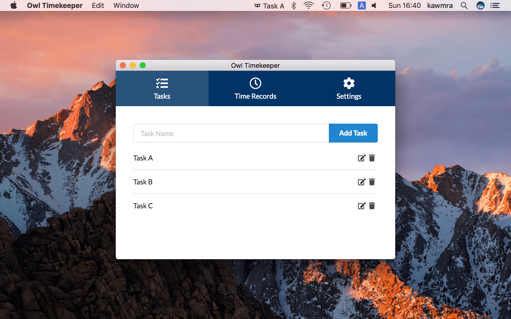
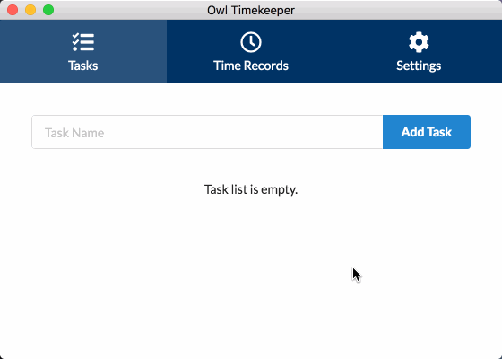

# Owl Timekeeper

<p>


</p>

<b align="center">超シンプルな時間記録アプリ</b>



Translations: [English](https://github.com/kawmra/Owl-Timekeeper/blob/master/README.md), [日本語](https://github.com/kawmra/Owl-Timekeeper/blob/master/README.ja.md)

## アプリについて


Owl Timekeeper は、時間の記録を簡単にするためのアプリです。
時間を記録したいタスクを登録し、メニューバーからタスクを切り替えるだけでどのタスクにどれくらいの時間を費やしたかを記録できます。

タスクの切り替えはメニューバーから行えるので、タスクを切り替えるためにいちいち画面を切り替える必要はありません。

記録した時間はシンプルな UI で確認できます。
時間の記録はタスクを開始した時刻と終了した時刻として記録されます。
間違って記録した場合も直感的な UI で簡単に修正できるため、タスクの時間管理に気を取られる必要はありません。

## ダウンロード

git をクローンして[ビルド](#ビルド)するか、以下のリンクから最新のバイナリファイルをダウンロードできます。

[Owl Timekeeper 1.1.1](https://github.com/kawmra/Owl-Timekeeper/releases/download/v1.1.1/Owl.Timekeeper-1.1.1.dmg)

## 使い方

### タスクを登録する

`Tasks` 画面の上部にある入力欄にタスク名を入力し、 `Add Task` ボタンをクリックします。



### 時間を記録する

メニューバーにある Owl Timekeeper のアイコンをクリックし、時間の記録を開始したいタスクを選択します。

時間を記録するタスクを切り替えるには、別のタスクをクリックします。

タスクを切り替えると、切り替えた時点で一つ前のタスクの時間記録が終了し、新しく選択したタスクの時間記録が開始されます。

`Stop Recording` をクリックすると、現在のタスクの時間記録を終了します。


### 記録した時間を編集

記録した時間は `Time Records` 画面から確認できます。

もしも誤って時間を計測してしまったり、計測を止め忘れてしまっても大丈夫です。

タスクの合計時間をクリックし、時間記録の一覧を表示します。時間記録の横の編集アイコンをクリックすることで、時間記録を修正することができます。


## 設定

### データの保存先

`Settings` 画面の `Storage` 設定項目では、アプリのデータをどこに保存するかを指定できます。
デフォルト値は `/Users/[User Name]/Library/Application Support/Owl Timekeeper` です。

> 注意:
> データの保存先を変更しても、データ自体はコピー/移動されません。変更先のパスに Owl Timekeeper のデータが存在しない場合は新しく作成され、データが存在する場合はそのデータが使用されます。
> 変更後のパスにデータを移動したい場合、ご自身でデータをコピーまたは移動する必要があります。

## ビルド

### 実行

Owl Timekeeper をソースコードからビルドして実行するには、以下のコマンドを実行してください。

```
$ yarn start
```

アプリがデバッグモードで実行されます。 `Command + Shift + I (⌘⇧I)` で Chromium のデバッグ画面を開けます。

> 注意:
> デバッグモードで実行すると Electron として実行されます。そのためアプリ名や設定ファイルの保存先ディレクトリがプロダクションビルド版と異なります。

### パッケージ化

Owl Timekeeper をソースコードからパッケージ化して `app` ファイルや `dmg` ファイルを作成するには、以下のコマンドを実行してください。

```
$ yarn dist
```

`dist/` ディレクトリに `dmg` ファイルや `app` ファイルが生成されます。

## 謝辞

素敵なアプリアイコンとメニューバーアイコンは Motoharu Kawanishi さんに制作していただきました。

## ライセンス

MIT
