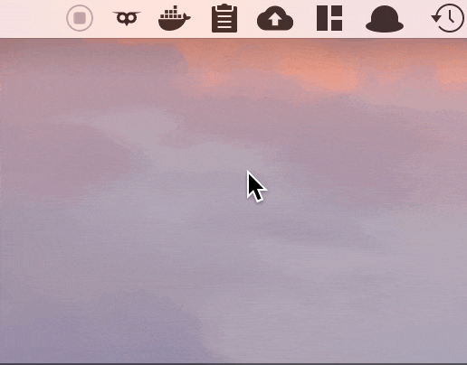
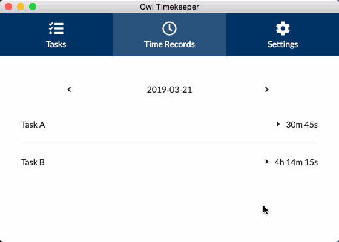

# Owl Timekeeper


<b>A super simple time tracking menu bar app for macOS 🦉</b>

Owl Timekeeper is an app to make it easy to record time.
You can register the tasks you want to record time, and switch the task from the menu bar to record how much time you spent on which task.

You can switch tasks from the menu bar, so there is no need to switch windows in order to switch tasks.

The recorded time can be checked with a simple UI.
This app records the time as when the task started and when the task ended.
Even if you recorded the time for a wrong task, you can easily fix it with an intuitive UI, so you don't have to worry about time tracking.

[日本語で読む](https://github.com/kawmra/Owl-Timekeeper/blob/master/README.ja.md)

## Download

You can clone git and [build](#build) or download the latest binary file from the link below.

[Owl Timekeeper 1.0.0](https://github.com/kawmra/Owl-Timekeeper/releases/download/untagged-5bdd9816461faee622d6/Owl.Timekeeper-1.0.0.dmg)

## How to use

### Register a task

Enter the task name in the input field at the top of the `Tasks` screen and click the `Add Task` button.


### Record time

Click the Owl Timekeeper icon in the menu bar and select the task for which you want to start recording time.

Click another task to change the task to be recorded time.

When switching tasks, the time recording of the previous task is ended, and the time recording of the newly selected task is started.

Click `Stop Recording` to end the time recording of the current task.



### Edit the recorded time

You can browse the recorded time from the `Time Records` screen.

If you accidentally record time or forget to stop time recording, no problem.

Click the total time for the task to display a list of time records. You can correct the time record by clicking the edit icon on the side of the time record.



## Settings

### Storage path

The `Storage` section on the` Settings` screen allows you to specify where app data is stored.
The default path is `/Users/[User Name]/Library/Application Support/Owl Timekeeper`.

> Note:
> Even if the storage path is changed, the data itself is not copied nor moved. If Owl Timekeeper data does not exist in the new storage path, it will be newly created, or if it exists, the data will be used.
> If you want to move data to the new storage path, you need to copy or move the data by yourself.

## Build

### Run

To build and run Owl Timekeeper from source code, run the following command:

```
$ yarn start
```

The app runs in debug mode. You can open the Chromium debug screen with `Command + Shift + I`.

> Note:
> When executed in debug mode, it is executed as Electron. Therefore, the application name and the storage path are different from the production build.

### Packaging

To package Owl Timekeeper from source code to create `app` and` dmg` files, run the following command:

```
$ yarn dist
```

`dmg` and `app` files are generated in the `dist/` directory.

## License

MIT
